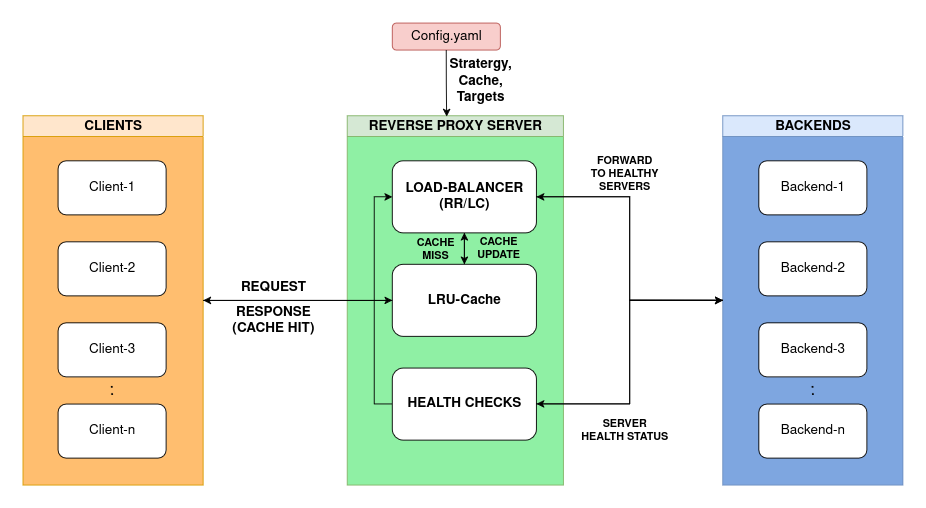

# Novus Load Balancer  

A custom-built **Reverse Proxy**, **Load Balancer**, and **LRU Cache** implemented in **Go**.  
It distributes client requests across backend servers, detects unhealthy nodes, and optimizes performance with caching. 
Works similar to servers of NGINX.


## Features
- **Reverse Proxy** → Forwards requests from clients to backend servers.  
- **Load Balancer** → Supports:
  - Round Robin  
  - Least Connections  
- **Health Checks** → Periodically pings backends and marks them **UP/DOWN**.  
- **Custom LRU Cache** → Built using a **custom doubly linked list** for O(1) operations.  
- **Configurable via YAML** → Easy setup of servers, strategies, and cache size.  


## Project Structure
```reverse-proxy-lb/
│── cmd/
│   ├── main.go          # Entry point of the application
│
│── config/
│   ├── config.go        # Loads configuration from file
│   ├── config.yaml      # Configuration file 
│
│── internal/
│   ├── proxy/
│   │   ├── proxy.go     # Reverse proxy logic
│   ├── loadbalancer/
│   │   ├── lb.go        # Load balancing logic
│   ├── cache/
│   │   ├── lru.go       # LRU cache implementation
│
│── pkg/
│   ├── utils.go         # Helper functions
│
|── Documentation.md     # Project Documentation
│── go.mod               # Go module file
│── go.sum               # Dependencies checksum
│── README.md            # Project Overview
````

## Architecture Diagram



## Usage 
1. Configure YAML for Proxy
```
server:
  port: 8080   # Proxy listening port

proxy:
  targets:
    - "http://localhost:5000"
    - "http://localhost:5001"

loadBalancer:
  strategy: "round_robin"   # Options: round_robin, least_connections

cache:
  enabled: true
  size: 100   # Number of entries in LRU cache

```
2. Start backend servers (example using Python HTTP server)
```
python -m http.server 5000
python -m http.server 5001
```
3. Run the reverse proxy server
```
go run cmd/main.go
```
4. Send request

- First request → forwarded to backend.
- Repeated request → served from cache (logs ✅ Cache hit).
- If backend goes down → logged as ❌ DOWN, skipped in routing.

See examples in Documentation.md

## Tech Stack
- Go (Golang)
- YAML for Configuration

